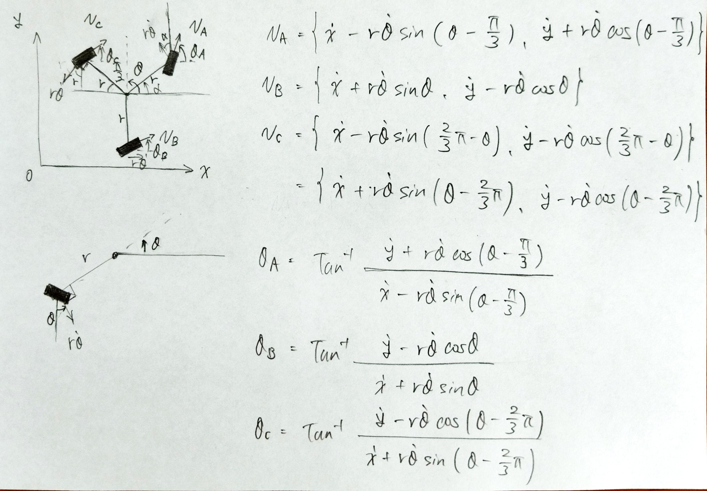
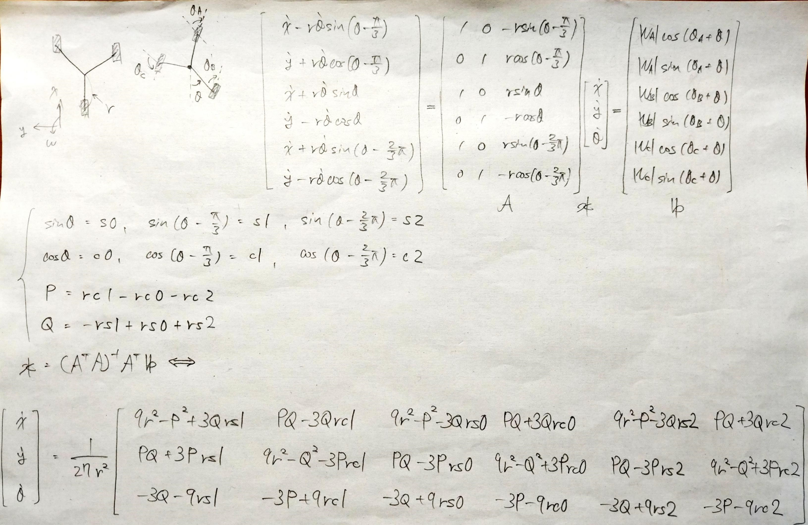
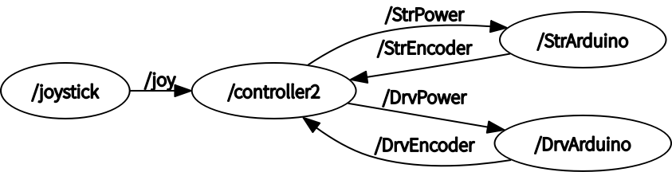

# robotAI
This is the program for Tsukuba Robot Contest 2022

# 依存パッケージのインストール
sudo apt-get install ros-melodic-joy ros-melodic-teleop-twist-joy ros-melodic-teleop-twist-keyboard ros-melodic-laser-proc ros-melodic-rgbd-launch ros-melodic-depthimage-to-laserscan ros-melodic-rosserial-arduino ros-melodic-rosserial-python ros-melodic-rosserial-server ros-melodic-rosserial-client ros-melodic-rosserial-msgs ros-melodic-amcl ros-melodic-map-server ros-melodic-move-base ros-melodic-urdf ros-melodic-xacro ros-melodic-compressed-image-transport ros-melodic-rqt-image-view ros-melodic-gmapping ros-melodic-navigation ros-melodic-interactive-markers

## arduinoインストール
sudo apt-get update  
sudo apt-get install arduino arduino-core

## rosserialのインストール
sudo apt-get update  
sudo apt-get install ros-melodic-rosserial-arduino  
sudo apt-get install ros-melodic-rosserial  
sudo usermod -a -G dialout YOUR_USER  

## roslibのインストール
cd sketchbook/libraries  
rm -rf ros_lib  
rosrun rosserial_arduino make_libraries.py .  

## urg_nodeのインストール
sudo apt-get install ros-melodic-urg-node

## catkin buildのインストール
sudo apt install python-catkin-tools

## USBシリアル接続時に自動で書込権限を付与する  
sudo vi /lib/udev/rules.d/50-udev-default.rules  
(Before)  
KERNEL=="tty[A-Z]*[0-9]|pppox[0-9]*|ircomm[0-9]*|noz[0-9]*|rfcomm[0-9]*", GROUP="dialout"  
(After)  
KERNEL=="tty[A-Z]*[0-9]|pppox[0-9]*|ircomm[0-9]*|noz[0-9]*|rfcomm[0-9]*", GROUP="dialout", MODE="0777"  # or 0666

# Inverse kinematics model of independent 3-wheel steering
θ is a constant

# Forward kinematics model
Using pseudo-inverse matrix  

# 手動操縦  
ステアを並進、回転移動させる（無限回転）  
「5」「6」同時押しでステア角を0に設定する  
roslaunch joy_control control4.launch  

# memo
(10/22)機体を走行させた感想  
問題：ヨー角がずれて操縦が困難  
原因：ステア角を変化させている時に駆動輪が回転して，回転数の差からヨー角度が変わっている  
      少しだけパワー不足で角度が完全に変わらない  
解決策：ステア角を回転させた後に駆動させる  
        位置誤差が出にくい工夫をする（ヘリンボーンギア？）  
その他：7.0は速すぎるので，3.0が良い  

ステア角の初期位置は、ハンドリング方向に対して左側に駆動輪ギアが位置する配置にする  

(11/19)  
問題：USBを差し込むたびにArduinoにプログラム書き換える必要がある（なぜ...）  
原因：仮想マシン上で選択したポート順番とポート番号が間違っていた  
解決策：ポートを1つ挿して仮想マシンでポートを選択してから、新たなポートを加える  

(11/23)  
やること  
・joy_controlで各ユニットに対してPIDパラメータ調整  

(11/24)  
自立走行ができた  
・サッカーボール、小バランスボールは転がっていかない  
・大バランスボールは、ソフトウェアとハードウェアで改善の余地あり  
あとは、安定性と速度の向上  

議題  
・大玉を滑らすか、ドリブルするか  
・結果を求めるか、ロマン(全方向移動)を求めるか  